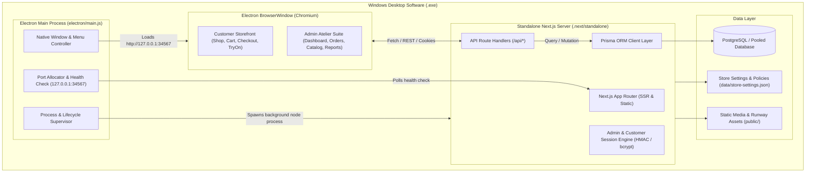
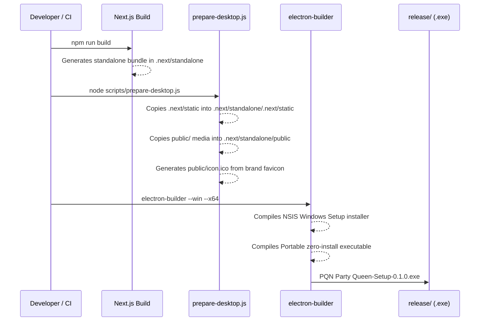

# PQN PARTY QUEEN — Desktop Application Architecture & System Design

This document details the complete system architecture, operational models, lifecycle processes, and packaging pipeline for the **PQN PARTY QUEEN Windows Desktop Application (`.exe`)**.

---

## 1. System Overview

**PQN PARTY QUEEN** is a luxury Indian couture e-commerce and atelier management platform. The application is architected to operate in two modes:
1. **Web / Cloud Production Mode**: Hosted on Linux servers via Next.js with reverse proxies and Supabase PostgreSQL.
2. **Windows Desktop Software Mode (`.exe`)**: A self-contained Windows application powered by **Electron** hosting an embedded **Next.js Standalone Node.js server**, running completely locally with preloaded luxury couture dummy data, realistic orders, customer accounts, and administrative management portals.

---

## 2. Process Lifecycle & Supervisory Architecture

### 2.1 Boot Sequence
1. **Single-Instance Enforcement**: `app.requestSingleInstanceLock()` prevents duplicate desktop instances from launching simultaneously. If another instance is launched, the existing window is focused and brought to the front.
2. **Server Discovery**: `startNextServer()` identifies the project root and locates the Next.js standalone runtime (`.next/standalone/server.js`).
3. **Environment Injection**: The server process is initialized with:
   - `PORT=34567` (or dynamically configured)
   - `HOSTNAME=127.0.0.1`
   - `NODE_ENV=production`
   - `DESKTOP_MODE=true`
4. **Health Check Waiter**: `checkServerReady()` polls `http://127.0.0.1:34567` every 1000ms until HTTP 200/304 is confirmed before opening the UI.
5. **Window Creation**: A customized 1440x900 native desktop window opens with the dark luxury brand theme (`#0B0C10`), application icon, and native menus.

### 2.2 Graceful Shutdown & Process Cleanup
When the user closes the application window or selects **Exit Software**:
- Electron hooks `before-quit` and `window-all-closed`.
- On Windows, `taskkill /pid <PID> /f /t` cleanly tears down the spawned Next.js server child tree.
- No zombie Node.js processes or blocked ports remain on the operating system.

---

## 3. Desktop Application Menus & Navigation

The desktop software includes integrated native menu shortcuts:
- **👑 PQN Store**:
  - `Storefront Home` (`Ctrl+H`): Instant navigation to customer homepage.
  - `Browse Collections` (`Ctrl+B`): Jumps to the luxury product catalog.
  - `Shopping Bag`: Opens cart and checkout.
  - `Exit Software` (`Ctrl+Q`): Clean application shutdown.
- **💼 Admin Suite**:
  - `Admin Dashboard` (`Ctrl+A`): Opens `/admin` overview and analytics.
  - `Orders & Fulfillment` (`Ctrl+O`): Opens order dispatch and courier management.
  - `Products & Inventory` (`Ctrl+P`): Product creation, editing, and stock manager.
  - `Analytics & Sales Reports`: Sales graphs, revenue metrics, and conversion rates.
  - `Store Settings & Logistics`: Tax rates, shipping partners, and invoice settings.
- **View**:
  - Fullscreen toggle (`F11`), Zoom In/Out, Reload (`Ctrl+R`), DevTools (`F12`).
- **Help & Credentials**:
  - Dialog displaying pre-loaded Super Admin, Manager, and Customer credentials.

---

## 4. Data Layer & Pre-loaded Dummy Dataset

The desktop software is bundled with an automated seeder (`scripts/seed-desktop-dummy-data.js`):
- **Admins & Roles**:
  - Super Administrator: `admin@pqnpartyqueen.com` (`Admin@12345`)
  - Master Administrator: `thep4rtyqueen@gmail.com` (`Admin@12345`)
  - Store Manager: `manager@pqnpartyqueen.com` (`Manager@12345`)
- **Customer Accounts**:
  - Demo Customer: `customer@pqnpartyqueen.com` (`Customer@12345`) with pre-set bridal sizing profile (Bust 36", Waist 30", Hips 40", Height 5'6") and New Delhi delivery address.
- **Couture Catalog**:
  - 12+ luxury couture garments covering all 6 atelier categories:
    1. Bridal & Festive Lehengas (Noor-e-Zari, Gulbahar Velvet)
    2. Luxury Suit Sets (Shahi Pishwas Anarkali, Kashmiri Sharara)
    3. Heritage & Cocktail Sarees (Chandrika Tissue Organza, Virasat Kanjeevaram)
    4. Gowns & Indo-Western (Midnight Azure Reception Gown)
    5. Designer Cord Sets (Aethelgard Rose Gold Jacquard)
    6. Velvet & Silk Dupattas (Imperial Emerald Velvet Shawl)
- **Logistics & Orders**:
  - Pre-seeded fulfilled and in-transit orders with sample Blue Dart & Delhivery tracking identifiers.

---

## 5. Packaging & Windows Installer (.exe) Pipeline

### Generated Artifacts in `release/`:
1. **`PQN Party Queen-Setup-0.1.0.exe`**: Full Windows NSIS installer with Desktop shortcut and Start Menu entry.
2. **`PQN Party Queen 0.1.0.exe`**: Standalone portable Windows executable that runs directly without installation.

---

## 6. Developer & Operational Commands

| Command | Action |
|---|---|
| `npm run desktop:prepare` | Synchronizes static chunks and media into the standalone folder |
| `npm run desktop:seed` | Resets and repopulates all dummy products, admins, and test data |
| `npm run desktop:dev` | Launches the Electron desktop shell against the local Next.js server |
| `npm run desktop:build` | Full end-to-end pipeline: builds Next.js, prepares assets, and compiles the `.exe` installer |
| `npm run desktop:pack` | Quick package: skips Next.js rebuild and packages existing standalone files into `.exe` |
